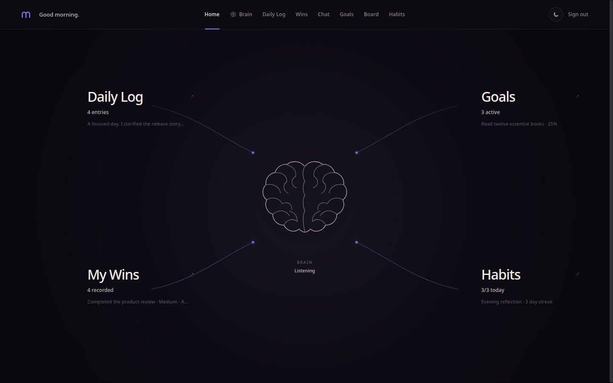
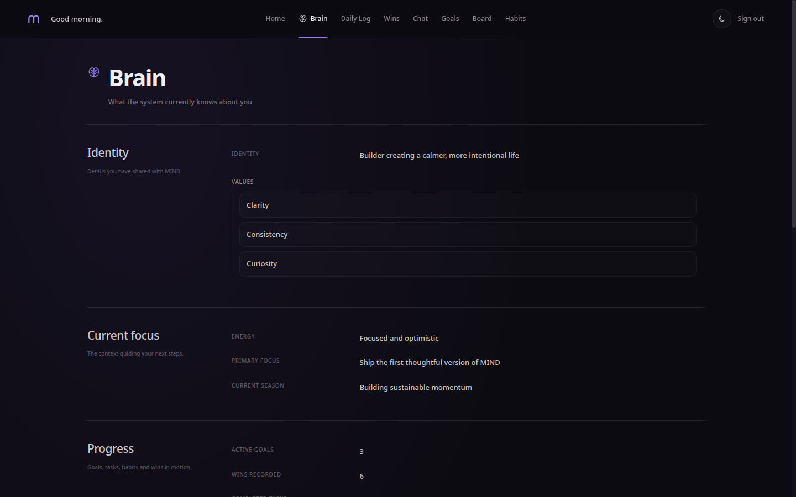
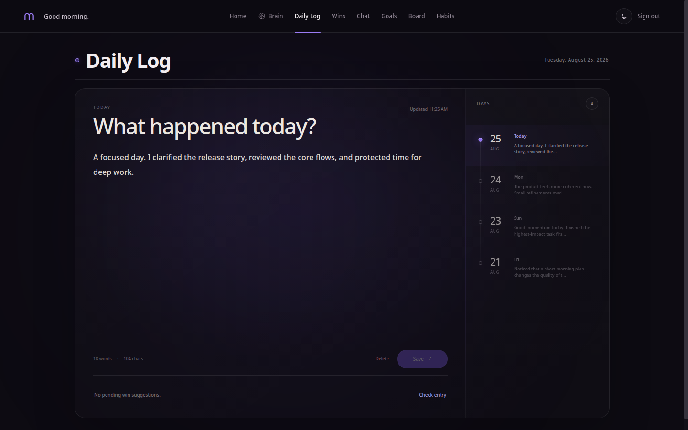
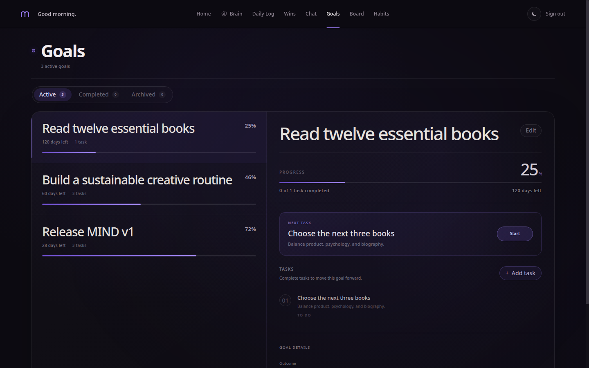
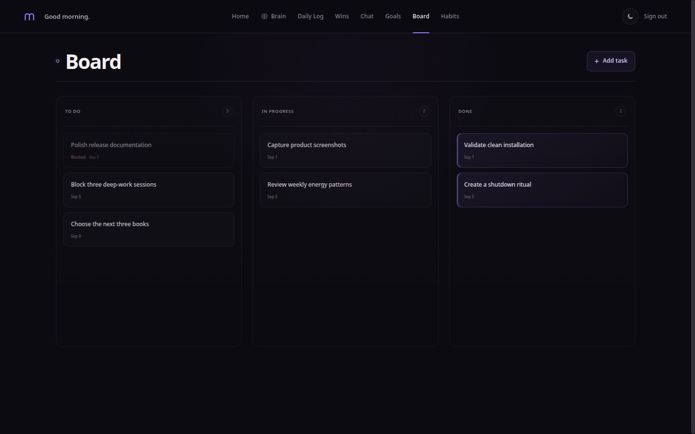
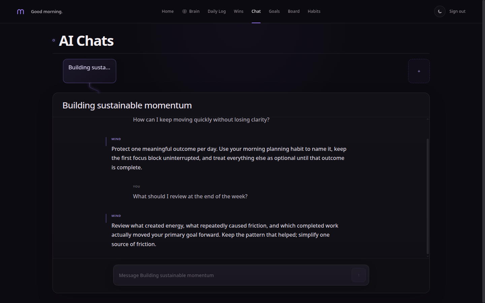
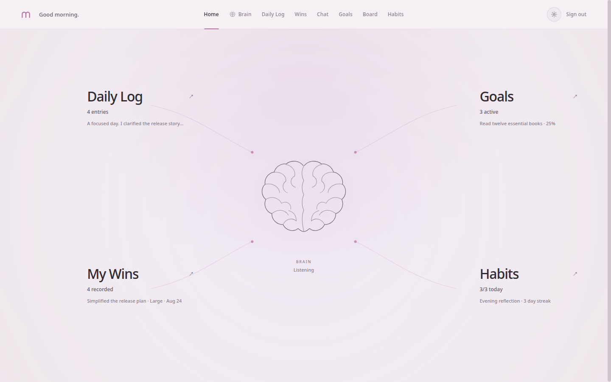

# PROJECT

A personal AI self-development platform that connects reflection, goals, tasks, habits, wins, and AI conversations through a shared memory.

PROJECT is a working title. The v1 release focuses on a small set of connected modules rather than a final product brand.

## Overview

PROJECT combines personal memory, daily reflection, goal planning, task management, habit tracking, recorded wins, and thematic AI chats. These modules are not isolated: they synchronize useful context into Brain, and AI Chats can read that context when generating responses.

## V1 modules

- **Auth** — registration and JWT-based authentication.
- **Home** — a summary of current activity across core modules.
- **Brain** — a read-first view of what the system currently knows about the user.
- **Daily Log** — dated reflection entries with optional Gemini analysis.
- **My Wins** — manual and module-generated accomplishments.
- **Goals** — goal lifecycle and progress tracking.
- **Board** — goal-linked tasks, dependencies, priorities, and status flow.
- **Habits** — habit status, completion history, streaks, and milestones.
- **AI Chats** — separate conversations that receive Brain context.

## Future / not exposed in v1

Backend code exists for **Analytics**, **Finance**, **Library**, **Notifications**, and **Progress Photos**, but their public REST routes are intentionally disabled. These modules are incomplete and are not considered release-ready.

## Architecture

- **Frontend:** Next.js 16, React 19, TypeScript, Tailwind CSS.
- **Backend:** Django 6, Django REST Framework, Simple JWT.
- **Database:** PostgreSQL (there is no SQLite runtime fallback).
- **AI:** Google Gemini through `google-genai`.
- **Core concept:** Brain stores JSON memory updated by module integrations; AI Chats read Brain as user context.

## Screenshots

### Home



### Brain



### Daily Log



### Goals



### Board



### AI Chat



### Light theme



## Repository structure

```text
project-ai-platform/
├── backend/
│   ├── brain/          # Shared memory and update boundary
│   ├── daily_logs/     # Reflection and Gemini analysis
│   ├── goals/          # Goals and progress
│   ├── board/          # Goal-linked tasks
│   ├── habits/         # Habits and streaks
│   ├── wins/           # Manual and automatic wins
│   ├── ai_chat/        # Context-aware chats
│   ├── config/         # Django settings and public URLs
│   └── requirements.txt
├── frontend/
│   ├── app/            # Next.js routes
│   ├── components/     # Shared UI
│   ├── lib/            # API client
│   └── package.json
└── LICENSE
```

## Requirements

- **Python 3.12+** (validated with Python 3.14.4).
- **Node.js 20.9.0+**, as required by the pinned Next.js version.
- **npm**, using the committed `package-lock.json`.
- **PostgreSQL**; no minimum server version is pinned by the repository.
- A **Google Gemini API key** for AI Chats and Daily Log analysis.

## PostgreSQL setup

Create a local role and database using names of your choice. For example:

```sql
CREATE USER project_user WITH PASSWORD 'choose-a-local-password';
CREATE DATABASE project_db OWNER project_user;
```

Run these statements through `psql` as a PostgreSQL administrator, then use the same database name, user, and password in `backend/.env`.

## Backend setup

From the repository root:

```bash
cd backend
python3 -m venv venv
source venv/bin/activate
python -m pip install -r requirements.txt
cp .env.example .env
```

Edit `.env`, replacing the Django secret, database credentials, and Gemini placeholder. Then initialize and start Django:

```bash
python manage.py migrate
python manage.py runserver
```

The development server listens on `http://127.0.0.1:8000` by default.

### Backend environment

`backend/.env.example` documents every setting used by the current v1 runtime:

- `DJANGO_SECRET_KEY`
- `DJANGO_DEBUG`
- `DJANGO_ALLOWED_HOSTS`
- `DJANGO_CORS_ALLOWED_ORIGINS`
- `DJANGO_CSRF_TRUSTED_ORIGINS`
- `DJANGO_SECURE_SSL_REDIRECT`
- `DJANGO_SESSION_COOKIE_SECURE`
- `DJANGO_CSRF_COOKIE_SECURE`
- `DJANGO_SECURE_HSTS_SECONDS`
- `DJANGO_SECURE_HSTS_INCLUDE_SUBDOMAINS`
- `DJANGO_SECURE_HSTS_PRELOAD`
- `DB_NAME`, `DB_USER`, `DB_PASSWORD`, `DB_HOST`, `DB_PORT`
- `GEMINI_API_KEY`

Boolean values accept `1`, `true`, `yes`, `on`, `0`, `false`, `no`, or `off`. Comma-separated host and origin values are parsed as lists.

### Gemini setup

PROJECT uses Google Gemini, currently with the `gemini-2.5-flash` model. Create an API key with Google AI Studio (or the corresponding Google provider), then set it as `GEMINI_API_KEY` in `backend/.env`. The backend can start without the key, but Gemini-backed features will not work.

## Frontend setup

In a second terminal, from the repository root:

```bash
cd frontend
npm ci
cp .env.example .env.local
npm run dev
```

The frontend runs on `http://localhost:3000` by default. `NEXT_PUBLIC_API_URL` must point to the backend origin; the local example uses `http://127.0.0.1:8000`.

## Validation

Backend:

```bash
cd backend
source venv/bin/activate
python manage.py check
python manage.py test
python manage.py makemigrations --check --dry-run
```

Frontend:

```bash
cd frontend
npm run lint
npx tsc --noEmit
npm run build
```

## Production notes

Production deployments must use a strong unique `DJANGO_SECRET_KEY`, `DJANGO_DEBUG=false`, explicit allowed hosts and frontend origins, production PostgreSQL credentials, and the correct `NEXT_PUBLIC_API_URL`. Enable secure cookies, HTTPS redirect, and HSTS only when HTTPS is correctly configured; choose HSTS settings carefully because browsers cache them.

## Open-source safety

Never commit `.env`, `.env.local`, API keys, production signing secrets, database passwords, private hostnames, or generated uploads. Commit only the provided `.env.example` files with placeholder values.

## License

PROJECT is available under the [MIT License](LICENSE).
